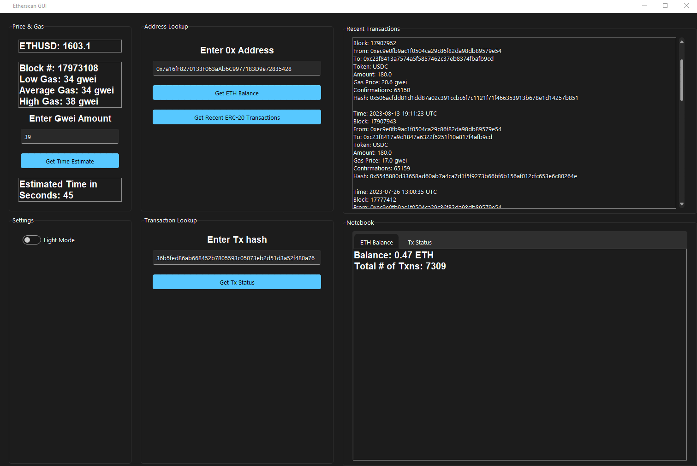

# Use

- Requires you to put in your Etherscan API key in the API call functions, so it can grab the data.

# Features

- Input address: See ETH balance, total number of transactions, and 10 most recent ERC-20 transactions
- Input tx hash: See status and details of a specific transaction
- Shows current ETH price, block, and gas rates in GWEI
- Confirmation Time Estimator Based on an inputted GWEI amount
- Dark/Light Mode Toggle

## Resources

- EtherScan Docs: https://docs.etherscan.io/
- Windows 11 Theme: https://github.com/rdbende/Sun-Valley-ttk-theme-svg
- Etherscan API python wrapper: https://github.com/pcko1/etherscan-python